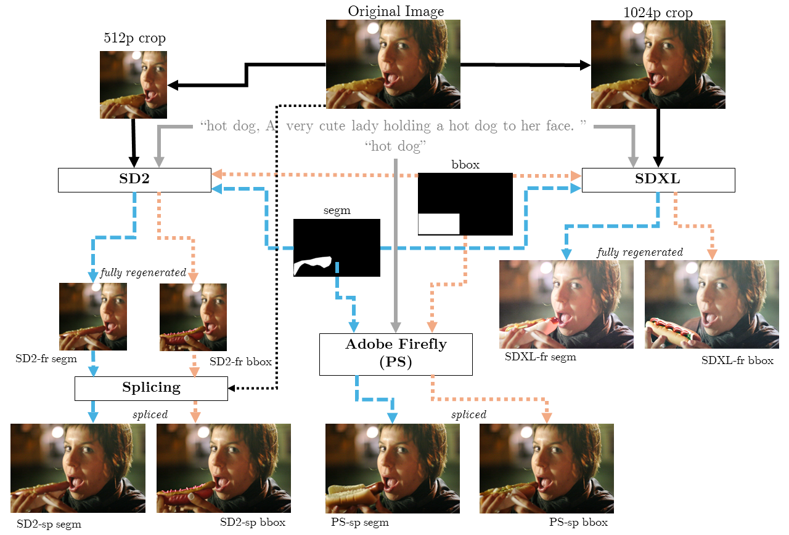

# TGIF: Text-Guided Inpainting Forgery Dataset

This dataset contains approximately 75k fake images, manipulated by text-guided inpainting methods (SD2, SDXL, and Adobe Firefly).
The authentic images originate from [MS-COCO](https://cocodataset.org/), with a [CC BY 4.0 license](https://creativecommons.org/licenses/by/4.0/), and have resolutions up to 1024x1024 px.
We provide both the manipulated image where the inpainted area is spliced in the original image (SD2-sp, PS-sp), as well as the fully-regenerated image (SD2-fr, SDXL-fr), when possible.

The dataset corresponds to the paper "TGIF: Text-Guided Inpainting Forgery Dataset", which is currently submitted and under review.

We distribute this dataset under the [CC BY-SA 4.0 license](https://creativecommons.org/licenses/by-sa/4.0/).

## TODOs
- [ ] Separate download links for training/validation and test set
- [ ] Add GIQA scores to metadata
- [ ] Add benchmark results (per image)
- [ ] Add code used for generation (SD python script & Photoshop script)
- [ ] Add paper pdf and BibTex code

## Dataset specifications
| **Manipulation types**                             |                                    |
|----------------------------------------------------|------------------------------------|
| **# masks**                                        | 2 (segmentation & bounding box)    |
| **# variations**                                   | 3 per generation                   |
| **# sub-datasets**                                 | 4 (SD2-sp, PS-sp, SD2-fr, SDXL-fr) |
| **Total # manipulated images per authentic image** | 2 * 3 * 4 = 24                     |

| **Dataset size**         | **Training** | **Validation** | **Testing** | **Total** |
|--------------------------|--------------|----------------|-------------|-----------|
| **# authentic images**   | 2 440        | 341            | 343         | 3 124     |
| **# manipulated images** | 58 560       | 8 184          | 8 232       | 74 976    |

## Downloadlinks
* Fake images
  * [SD2](https://cloud.ilabt.imec.be/index.php/s/LketizMaLoKBdaH) (46 GB)
  * [SDXL](https://cloud.ilabt.imec.be/index.php/s/3HipNJHob2WyZaW) (41 GB)
  * [Adobe Firefly](https://cloud.ilabt.imec.be/index.php/s/R7dgjNg4tNWEybR) (17.8 GB)
* Real images
  * [SD2](https://cloud.ilabt.imec.be/index.php/s/naMSpLxEd9fMqyR) (4 GB)
  * [SDXL crops](https://cloud.ilabt.imec.be/index.php/s/nf7am5P5tCC7Xjf) (3 GB)
* Masks
  * [SD2](https://cloud.ilabt.imec.be/index.php/s/HHo8bj4xdrcDb3Q)
  * [SDXL](https://cloud.ilabt.imec.be/index.php/s/mTzPq5KM64WcHg6)
  * [Photoshop masks](https://cloud.ilabt.imec.be/index.php/s/LEid5QGPzfHTaKg)
* Metadata
  * [SD2](https://cloud.ilabt.imec.be/index.php/s/PBezTRictoX3iLa)
  * [SDXL](https://cloud.ilabt.imec.be/index.php/s/DXEq5s5dY77Bm7D)

