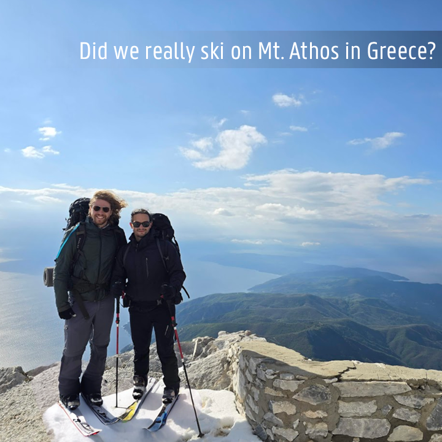

# TGIF: Text-Guided Inpainting Forgery Dataset

This dataset contains approximately 75k fake images, manipulated by text-guided inpainting methods (SD2, SDXL, and Adobe Firefly).
The authentic images originate from [MS-COCO](https://cocodataset.org/), with a [CC BY 4.0 license](https://creativecommons.org/licenses/by/4.0/), and have resolutions up to 1024x1024 px.
We provide both the manipulated image where the inpainted area is spliced in the original image (SD2-sp, PS-sp), as well as the fully-regenerated image (SD2-fr, SDXL-fr), when possible.

The dataset corresponds to the paper "TGIF: Text-Guided Inpainting Forgery Dataset", which was accepted at the [IEEE International Workshop on Information Forensics & Security 2024](https://wifs2024.uniroma3.it/).

We distribute this dataset under the [CC BY-SA 4.0 license](https://creativecommons.org/licenses/by-sa/4.0/).


## Visual explanation of our insights
<br>
*Did the authors really go skiing on Greece's iconic Mt. Athos?*

The image above is fake - the skis were added using text-guided inpainting. Can current forensic methods detect this manipulation?

Find out in our [**blog post**](https://media.idlab.ugent.be/tgif-dataset), where we explain our insights in a simple and visual way.


## Dataset specifications

<br>
*How we created 75k fake images using SD2, SDXL, and Adobe Photoshop/Firefly. We used 2 types of masks, and differentiate between spliced and fully regenerated inpainted images. Note seen in the diagram: each inpainting operation creates 3 variations in batch.*

| **Manipulation types**                             |                                    |
|----------------------------------------------------|------------------------------------|
| **# masks**                                        | 2 (segmentation & bounding box)    |
| **# variations** (num_images_per_prompt)           | 3 per generation (in batch)        |
| **# sub-datasets**                                 | 4 (SD2-sp, PS-sp, SD2-fr, SDXL-fr) |
| **Total # manipulated images per authentic image** | 2 * 3 * 4 = 24                     |

| **Dataset size**         | **Training** | **Validation** | **Testing** | **Total** |
|--------------------------|--------------|----------------|-------------|-----------|
| **# authentic images**   | 2 440        | 341            | 343         | 3 124     |
| **# manipulated images** | 58 560       | 8 184          | 8 232       | 74 976    |

## Download
[Download all images](https://cloud.ilabt.imec.be/index.php/s/xEeAzrY7ES9KA8o)

The downloads are organized in masks, original, SD2-sp, PS-sp, SD2-fr, SDXL-fr. And each of those are separated in training, validation, and testing, respectively.

Metadata (incl. NIMA, GIQA & ITM scores) is available in this repository (_metadata_), as well as the benchmark results (_benchmark-results_).

Code to perform text-guided inpainting with SD2, SDXL & Adobe Photoshop/Firefly is added in the _code_ folder of this repository, as well as code to calculate NIMA, GIQA, and ITM scores, and to  compress images using JPEG and WEBP. 

## Reference
This work will be presented in the [IEEE International Workshop on Information Forensics & Security 2024](https://wifs2024.uniroma3.it/). The preprint can be downloaded [on arXiv](https://arxiv.org/abs/2407.11566).

```js
@InProceedings{mareen2024tgif,
  author="Mareen, Hannes and Karageorgiou, Dimitrios and Van Wallendael, Glenn and Lambert, Peter and Papadopoulos, Symeon",
  title="TGIF: Text-Guided Inpainting Forgery Dataset",
  booktitle="Proc. Int. Workshop on Information Forensics and Security (WIFS) 2024",
  year="2024"
}
```
