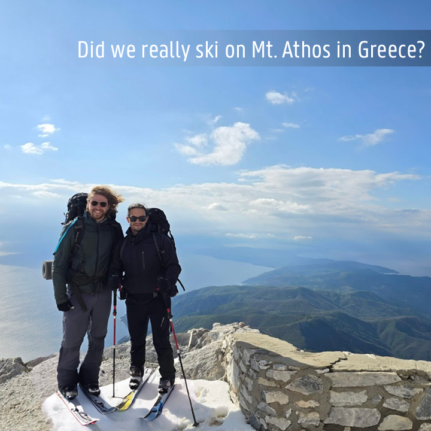
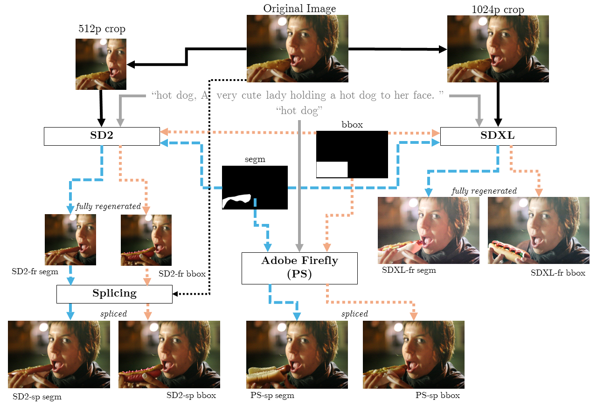

# TGIF & TGIF2: Text-Guided Inpainting Forgery Dataset

The **TGIF dataset** contains approximately 75k fake images, manipulated by text-guided inpainting methods (SD2, SDXL, and Adobe Firefly).
Additionally, **TGIF2** extended TGIF by including 196k new fake images, manipulated with FLUX.1 models, and adding new random, non-semantic masks.
In total, this results in 271k fake images.

The authentic images originate from [MS-COCO](https://cocodataset.org/), with a [CC BY 4.0 license](https://creativecommons.org/licenses/by/4.0/), and have resolutions up to 1024x1024 px.
We provide both the manipulated image where the inpainted area is (sp) in the original image, as well as the fully-regenerated image (fr), when possible.

The dataset corresponds to the paper "TGIF: Text-Guided Inpainting Forgery Dataset", which was accepted at the [IEEE International Workshop on Information Forensics & Security 2024](https://wifs2024.uniroma3.it/).
The extended version (TGIF2) corresponds to the paper "TGIF2: Extended Text-Guided Inpainting Forgery Dataset & Benchmark", which was accepted at the [Journal on Information Security](https://link.springer.com/journal/13635).

We distribute this dataset under the [CC BY-SA 4.0 license](https://creativecommons.org/licenses/by-sa/4.0/).


## Visual explanation of TGIF insights
<br>
*Did the authors really go skiing on Greece's iconic Mt. Athos?*

The image above is fake - the skis were added using text-guided inpainting. Can current forensic methods detect this manipulation?

Find out in our [**TGIF blog post**](https://media.idlab.ugent.be/tgif-dataset), where we explain our insights in a simple and visual way.

A blog post on the additional insights of TGIF2 will come soon.


## Dataset specifications

<br>
*In TGIF, we created 75k fake images using SD2, SDXL, and Adobe Photoshop/Firefly. We used 2 types of masks, and differentiate between spliced and fully regenerated inpainted images. Not seen in the diagram: each inpainting operation creates 3 variations in batch.*

*In TGIF2, we created an additional 196k fake images using FLUX.1 schnell, FLUX.1 dev, FLUX.1 filldev with the same 2 types of masks, as well as random, non-semantic rectangles as mask.*

| **Manipulation types**                             |                                    |
|----------------------------------------------------|------------------------------------|
| **# masks**                                        | 2 (segmentation & bounding box) or 1 (random rectangle)   |
| **# sub-datasets**                                 | 4 (SD2-sp, PS-sp, SD2-fr, SDXL-fr) |
| **# sub-datasets (+TGIF2)**                                 | 6+9 (flux1schnell-sp, flux1schnell-fr, flux1dev-sp, flux1dev-fr, flux1filldev-sp, flux1filldev-fr) + (sd2-random-sp, sd2-random-fr, sdxl-random-fr, flux1schnell-random-sp, flux1schnell-random-fr, flux1dev-random-sp, flux1dev-random-fr, flux1filldev-random-sp, flux1filldev-random-fr) |
| **# variations** (num_images_per_prompt)           | 3 per generation (in batch)        |
| **Total # manipulated images per authentic image (TGIF)** | 2 * 4 * 3 = 24                     |
| **Total # manipulated images per authentic image (+TGIF2)** | (2 * 6 * 3) + (1 * 9 * 3) = 36 + 27 = 63                     |

| **Dataset size**         | **Training** | **Validation** | **Testing** | **Total** |
|--------------------------|--------------|----------------|-------------|-----------|
| **# authentic images**   | 2 440        | 341            | 343         | 3 124     |
| **# manipulated images (TGIF)** | 58 560       | 8 184          | 8 232       | 74 976    |
| **# manipulated images (+TGIF2)** | 153 720       | 21 483          | 21 609       | 196 812    |
| **# manipulated images (TGIF+TGIF2)** | 212 280       | 29 667          | 29 841       | 271 788    |


## Download
* [Download all TGIF images](https://cloud.ilabt.imec.be/index.php/s/xEeAzrY7ES9KA8o)
* [Download all TGIF2 FLUX images](https://cloud.ilabt.imec.be/index.php/s/KG48tLZZzifC5WE)
* [Download all TGIF2 random images](https://cloud.ilabt.imec.be/index.php/s/GDGewtTFcHccaNj)

For TGIF, the downloads are organized in masks, original, SD2-sp, PS-sp, SD2-fr, and SDXL-fr. 
For TGIF2 FLUX, the downloads are organized in flux1schnell-sp, flux1schnell-fr, flux1dev-sp, flux1dev-fr, flux1filldev-sp, and flux1filldev-fr. They additionally contain masks-flux and original-flux, as slightly different crops may be taken than in TGIF (FLUX requires divisibility by 16px instead of 8px). The *ps_mask.png masks of the *-sp subsets can still be found in the masks folder in the original TGIF dataset.
For TGIF2 random, the downloads are organized in masks-sd2, masks-sdxl, masks-flux, sd2-sp, sd2-fr, sdxl-fr, flux1schnell-sp, flux1schnell-fr, flux1dev-sp, flux1dev-fr, flux1filldev-sp, and flux1filldev-fr.
Each of the directories mentioned above are separated in training, validation, and testing, respectively.

Metadata and benchmark results (incl. generative quality scores) is available in this repository (_metadata_, _metadata\_flux_, and _metadata\_random_, and _benchmark-results_).

Code to perform text-guided inpainting with SD2, SDXL, FLUX models, and Adobe Photoshop/Firefly is added in the _code_ folder of this repository, as well as code to calculate generative quality scores, and to compress images using JPEG and WEBP. Note that for the FLUX.1 dev and FLUX.1 Fill dev models, you should add your own huggingface access code in _code/inpaint-loop.py_.

The [NIMA](https://github.com/yunxiaoshi/Neural-IMage-Assessment) and [GIQA](https://github.com/cientgu/GIQA) checkpoints are archived [here](https://cloud.ilabt.imec.be/index.php/s/DQwTjE6A3ydgxjq). The ITM, SD2 and SDXL weights are downloaded automatically.

## Filenaming
The files are named as follows:
* orig:
  * {coco_id}_orig.png
  * {coco_id}\_orig\_{crop_size}.png
* masks:
  * {coco_id}\_mask\_{crop_size}.png
  * {coco_id}\_mask\_{mask_type}.png
  * * {coco_id}\_mask\_{mask_type}\_{crop_size}.png
  * {coco_id}\_mask\_{mask_type}.png\_ps\_mask.png - Photoshop adaptation of mask (extra border)
* SD2-sp, flux1schnell-sp, flux1dev-sp, flux1filldev-sp: {coco_id}\_mask\_{mask_type}.png_ps_mask.png_{gen_model}_{var_id}.png
* PS-sp: {coco_id}\_mask\_{mask_type}.png_ps_{var_id}.png (i.e., no extra ps_mask.png in filename)
* SD2-fr: {coco_id}\_mask\_{mask_type}.png_sd2-512_{var_id}.png  (i.e., 512 instead of 1024)
* SDXL-fr, flux1schnell-fr, flux1dev-fr, flux1filldev-fr: {coco_id}\_mask\_{mask_type}.png_{gen_model}-1024_{var_id}.png (i.e., 1024 instead of 512)
* SD2-random-sp, flux1schnell-sp, flux1dev-sp, flux1filldev-sp: {coco_id}\_mask\_random.png_{gen_model}_{var_id}.png
* SD2-random-fr: {coco_id}\_mask\_random.png_sd2-512_{var_id}.png
* SDXL-random-fr, flux1schnell-fr, flux1dev-fr, flux1filldev-fr: {coco_id}\_mask\_random.png_sd2-1024_{var_id}.png

With
* crop_size: 512 or 1024
* mask_type: bbox, segm, or random
* var_id: 0, 1, or 2
* gen_model: sd2, sdxl, flux1schnell, flux1dev, flux1filldev

## Reference
TGIF was presented in the [IEEE International Workshop on Information Forensics & Security 2024](https://wifs2024.uniroma3.it/). The preprint can be downloaded [on arXiv](https://arxiv.org/abs/2407.11566), and the published version on [IEEEXplore](https://ieeexplore.ieee.org/document/10810690).

TGIF2 was accepted for publication at the [Journal on Information Security](https://link.springer.com/journal/13635), as part of the collection [Advances in Information Forensics and Security](https://link.springer.com/collections/icejghjehj). Preprint will be available for download soon.

```js
@InProceedings{mareen2024tgif,
  author={Mareen, Hannes and Karageorgiou, Dimitrios and Van Wallendael, Glenn and Lambert, Peter and Papadopoulos, Symeon},
  title={{TGIF}: Text-Guided Inpainting Forgery Dataset},
  booktitle={Proc. Int. Workshop on Information Forensics and Security (WIFS) 2024},
  year={2024}
}
```

```js
@article{mareen2026tgif2,
  author={Mareen, Hannes and Karageorgiou, Dimitrios and Giakoumoglou, Paschalis and Lambert, Peter and Papadopoulos, Symeon and Van Wallendael, Glenn},
  title={{TGIF2}: Extended Text-Guided Inpainting Forgery Dataset \& Benchmark},
  journal={Journal on Information Security},
  year={2026},
  publisher={Springer}
}
```
